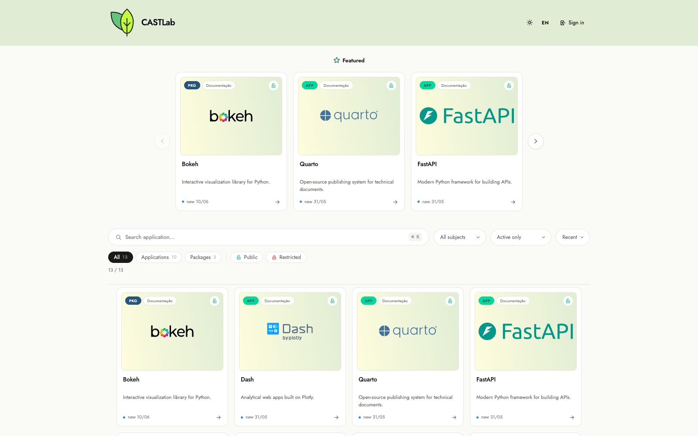
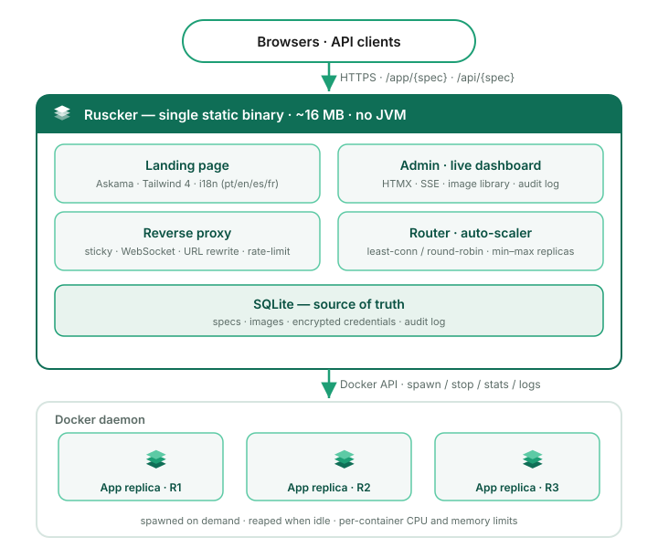

<picture>
  <source media="(prefers-color-scheme: dark)"
          srcset="crates/ruscker-admin/assets/brand/ruscker-lockup-horizontal-dark.svg">
  
</picture>

[](https://github.com/StrategicProjects/ruscker/releases)
[](LICENSE)
[](https://strategicprojects.github.io/ruscker/)
[](https://doi.org/10.5281/zenodo.20849123)

**Ruscker** is a lightweight, single-binary alternative to **ShinyProxy**
and **Shiny Server Free** — a **portal and orchestrator** for
containerized web workloads. It serves and load-balances
container-per-session interactive apps (R/Shiny, Streamlit, Dash, Voilà,
Jupyter, RStudio) and container-per-API stateless HTTP services
(Plumber2, FastAPI) behind a single proxy, with a custom landing page and
an admin panel. It accepts an existing ShinyProxy `application.yml`
without schema rewrites, while `ruscker.yml` is the canonical service
config, so migration is friction-free.

It ships as a **single, ultra-lightweight static binary** with **instant
startup** — the idle footprint is about **14 MB**.

📖 **Documentation: <https://strategicprojects.github.io/ruscker/>**
(install · migrate · configure · admin · deploy).

<p align="center">
  
</p>

## How it works

Visitors and API clients hit one Ruscker process. It serves the landing
page and admin UI, and reverse-proxies each request to the right app
container — picking a replica, keeping Shiny sessions sticky, upgrading
WebSockets, and rewriting URLs. When no replica can take the load (and
the spec allows it), Ruscker asks the Docker daemon to spawn one; idle
containers are reaped automatically.

<p align="center">
  
</p>

## Why Ruscker

Modern web workloads want speed and minimal overhead. Ruscker delivers
that without giving up convenience:

- **Zero-friction migration** — bring your apps over with a familiar
  YAML schema, no rewrite.
- **Single compiled binary** — one artifact to ship and run, with a tiny
  idle footprint (~14 MB) and instant startup.
- **Batteries included** — a real admin panel, a monitoring dashboard
  with short polling, and load balancing, out of the box.
- **Anything in a container** — interactive apps and stateless HTTP APIs
  alike, isolated per session or pooled per replica, with an auto-scaler
  that spawns and reaps containers on demand.

## What it can serve

Ruscker runs **one container per session** for stateful apps and **one
per replica** for stateless APIs — so anything that runs in a container
and speaks HTTP or WebSocket fits, not just Shiny:

- **Interactive apps** — Shiny, Streamlit, Dash, Gradio, Panel, Voilà,
  Marimo, Pluto.jl.
- **APIs & model serving** — Plumber/Plumber2, FastAPI, Flask, plus
  BentoML, MLflow, vLLM, Ollama, Text Generation Inference.
- **Notebooks & IDEs** — JupyterLab, RStudio Server, `code-server`.
- **BI & GenAI UIs** — Superset, Metabase, Datasette, Stable Diffusion
  WebUI, Open WebUI.

The full catalogue (with the "works-with-caveats" and "not the right
tool" cases) is in
[**What Ruscker can serve**](https://strategicprojects.github.io/ruscker/use-cases.html).

## Status

**Production-ready and running in production.** Releases are multi-arch
(amd64 + arm64) and [cosign-signed]; the
[releases page](https://github.com/StrategicProjects/ruscker/releases)
has the current version.

[cosign-signed]: https://strategicprojects.github.io/ruscker/installation.html#verifying-release-artifacts

> **~14 MB idle** — measured on a real production deployment serving a
> real 31-spec config, with apps spawning on demand. (The JVM-based
> proxy it replaced on the same machine sat at ~540 MB.)

What's in the box:

- **Reverse proxy + load balancer** — sticky sessions, WebSocket
  forwarding, per-spec replica pools, an auto-scaler, and absolute-URL
  rewriting so unmodified Shiny/Streamlit apps work behind a sub-path.
- **Container backend** (Docker) that spawns app containers on demand,
  applies per-container CPU/memory limits, and reaps idle ones.
- **Admin panel** — full apps CRUD (including API, scaling, resource and
  lifecycle settings), Media, encrypted Credentials, a live-preview
  Appearance editor, **Viewer / Editor / Admin** accounts with a password
  policy and generator, consolidated per-user editing, server-side
  pagination (50 per page) with case-insensitive search (accented letters
  included) across usernames, groups and profiles, and an **Activity** history.
- **Containers dashboard** — CPU/memory sparklines, live-follow logs and
  stop/restart controls, refreshed every five seconds by polling
  `GET /admin/dashboard/snapshot`.
- **Per-app step-up MFA** — `require-mfa: true` gates a spec before a
  replica is selected or spawned. Users enrol one TOTP factor, with
  one-time recovery codes, shared by all protected apps;
  `mfa-validity-days` controls proof freshness (7 by default, `0` for the
  login session, capped at 30). Browser visits redirect to
  enrolment/challenge and APIs fail with `401`/`403`. TOTP secrets require
  `RUSCKER_MASTER_KEY`; trusted-device cookies are opaque, HttpOnly and
  stored hash-only, with password changes/resets, MFA resets and **Forget
  devices** revoking them. `RUSCKER_ADMIN_TOKEN` bypasses are audited. See
  the [admin guide].
- **Identity headers for apps** — `add-default-http-headers: true`
  forwards `X-SP-UserId` / `X-SP-UserGroups`, while
  `identity-claims: [email, setor]` adds the matching
  `X-Ruscker-User-*` claims for signed-in users; Ruscker defaults both off
  (unlike ShinyProxy's X-SP pair). Reserved client headers are stripped on
  HTTP and WebSocket requests to prevent spoofing, and missing claims are
  omitted. See the [YAML reference].
- **Hardened cookie boundary** — hosted apps keep their own cookies, but
  their responses cannot overwrite Ruscker session, sticky or MFA cookies:
  reserved `Set-Cookie` values and cookie-clearing `Clear-Site-Data`
  directives are filtered at the proxy. See the [security guide].
- **Scheduled jobs** — the Admin-only [**Schedules** page] runs a spec's
  image, environment, volumes and credentials to completion on a cron,
  with an optional command override, run history/log tail, leader-only HA
  firing, no fire-on-create, one catch-up after downtime and a per-run
  timeout (1 hour by default); failures raise the `job-failed` alert webhook.
  (Local Docker backend; not yet available with the multi-host backend.)
- **Named-volume management** — the Disk panel lists Docker volumes with
  live reference counts and can create labelled volumes; removal is offered
  only for Ruscker-created volumes with zero references and no catalog use.
  (Local Docker backend; the multi-host backend reports it as unavailable.)
- **Operations** — `/healthz` + `/readyz` probes, graceful shutdown,
  structured (JSON) logging, per-API rate limiting + CORS, request
  body-size limits, an opt-in Prometheus `/metrics` endpoint, and
  `validate --strict-compat` migration pre-flight, plus alert webhooks for
  spawn failures, dead replicas, saturation and failed jobs.
- **Persistence + UI stack** — SQLite is the zero-config source of truth;
  Postgres provides the shared catalog and session stores for HA. The UI is
  server-rendered with Askama templates, HTMX and Alpine.js, with no Node
  build step.
- **Distribution** — a multi-arch Docker image, a Debian package with a
  hardened `systemd` unit, static musl tarballs, a Homebrew tap, and
  cosign-signed release artifacts.

The repository contains 760+ unit + integration test cases. The default
`cargo test` suite needs no Docker; feature-gated suites exercise the Docker
backend (`docker-it`), the full proxy + WebSocket path (`e2e`), and real
Shiny/Streamlit WebSockets (`ws-e2e`).

[admin guide]: https://strategicprojects.github.io/ruscker/admin.html#2fa--mfa-for-selected-apps
[Schedules page]: https://strategicprojects.github.io/ruscker/admin.html#schedules
[YAML reference]: docs/YAML_SCHEMA.md
[security guide]: docs/SECURITY.md

<p align="center">
  
  <br><em>Apps catalogue — every spec field editable from the web UI, no YAML.</em>
</p>

<p align="center">
  
  <br><em>Containers dashboard — per-replica CPU/memory, refreshed on a short poll.</em>
</p>

## Install

Every tagged release publishes a multi-arch Docker image, `.deb`
packages, and static `musl` tarballs (amd64 + arm64).

### Quick install (Linux, amd64/arm64)

```bash
curl -fsSL https://raw.githubusercontent.com/StrategicProjects/ruscker/main/install.sh | sh
```

Picks the right artifact from the latest release: the `.deb` (with the
`systemd` unit + an auto-generated admin token) on Debian/Ubuntu, or the
static binary into `/usr/local/bin` elsewhere. Pin a version or target
dir with `./install.sh vX.Y.Z` (any tag from the releases page) or
`PREFIX=~/.local/bin ./install.sh`.

### Homebrew (macOS / Linux)

```bash
brew install strategicprojects/tap/ruscker
```

Linux pulls the prebuilt musl binary; macOS builds from source.

### Docker

```bash
docker run --rm -p 8080:8080 \
  -v "$PWD/ruscker.yml:/etc/ruscker/ruscker.yml:ro" \
  -v /var/run/docker.sock:/var/run/docker.sock \
  ghcr.io/strategicprojects/ruscker:latest \
  serve --config /etc/ruscker/ruscker.yml --bind 0.0.0.0:8080 --docker
```

### Debian / Ubuntu

```bash
sudo apt install ./ruscker_<version>_amd64.deb
# Creates a `ruscker` user, installs a systemd unit, and prints a
# freshly-generated admin token on first install.
```

### From source

```bash
git clone https://github.com/StrategicProjects/ruscker
cd ruscker
cargo build --release          # rustup fetches the pinned toolchain on first run
./target/release/ruscker --help
```

The first source build downloads the pinned standalone Tailwind CLI to
`~/.cache/ruscker`. For an offline build, provide a previously downloaded
binary with `TAILWIND_BIN=/path/to/tailwindcss cargo build --release`.
Backend-only builds and tests may use `TAILWIND_SKIP=1`, which deliberately
embeds placeholder CSS and therefore produces an unstyled admin UI.

Development and release builds use Rust 1.96.0 from
`rust-toolchain.toml`. The MSRV source of truth is
`workspace.package.rust-version` in `Cargo.toml` (currently 1.94.0), and
the `msrv` workflow reads that same field when checking the locked graph.

## Quickstart

```bash
# Validate a config (and pre-flight migration compatibility)
ruscker validate examples/application.yml --strict-compat

# Run the portal + admin + proxy with the Docker backend
RUSCKER_ADMIN_TOKEN=$(openssl rand -hex 16) \
RUSCKER_MASTER_KEY=$(openssl rand -hex 32) \
ruscker serve \
  --config examples/application.yml \
  --bind 127.0.0.1:8080 \
  --docker
```

`ruscker validate` on the bundled example prints something like:

```
  Ruscker config validation
  ─────────────────────────
  file: examples/application.yml
  title: Ruscker Demo Portal

  Specs: 8 total      shiny 5 · api 1 · external 2
  State: active 7 · inactive 1

  ✓ no warnings
  ShinyProxy compatibility: ✓ no unsupported features
```

### CLI subcommands

```bash
ruscker validate <path>                  # parse + validate + report
ruscker validate <path> --strict-compat   # flag ShinyProxy features Ruscker ignores
ruscker serve [--config <path>] [--docker|--no-docker] [--db <file>]
              [--config-db-url <dsn>] [--base-path <path>]   # run the portal
ruscker import <path> --db <file>             # populate SQLite from YAML
ruscker import <path> --config-db-url <dsn>   # populate a Postgres HA catalog
ruscker export --db <file>               # round-trip SQLite back to YAML
ruscker show <path>                       # render YAML with env vars interpolated
ruscker inspect <path>                    # dump the fully-parsed config as JSON
```

Without `--config`, `serve` loads `ruscker.yml` from the working directory,
falling back to `application.yml` for existing deployments.

## YAML compatibility

`ruscker.yml` is the canonical service config. Ruscker also reads an
existing ShinyProxy `application.yml` schema unchanged as the migration
and import format, and adds Ruscker-specific fields (API specs, replica
pools, identity/MFA policy, landing customization) as you go. Migration
is typically a one-line change in your reverse proxy — point it at Ruscker
on the same port and paths.
See [`docs/YAML_SCHEMA.md`](docs/YAML_SCHEMA.md) and the
[migration guide](https://strategicprojects.github.io/ruscker/migrating.html).

Secret values should never go in YAML — use `${ENV_VAR}` interpolation or
the encrypted Credentials store; the validator flags plaintext secrets.

## Project layout

```
ruscker/
├── crates/
│   ├── ruscker-config/   # YAML schema + parsing + validation (pure)
│   ├── ruscker-core/     # traits, types, replica registry (pure)
│   ├── ruscker-docker/   # Docker backend (bollard)
│   ├── ruscker-proxy/    # sticky cookie + WebSocket pump
│   ├── ruscker-admin/    # landing + admin + proxy routes (axum/askama)
│   └── ruscker-cli/      # the `ruscker` binary
├── book/                 # the documentation site (mdBook)
├── docs/                 # ARCHITECTURE, YAML_SCHEMA, SECURITY, ADRs, mockups
└── examples/
    └── application.yml   # a generic, comprehensive reference config
```

Each crate carries module-level docs (`cargo doc --open`) describing its
scope and how to extend it.

## Documentation

| Doc | Purpose |
|---|---|
| [Documentation site](https://strategicprojects.github.io/ruscker/) | Install, migrate, configure, deploy |
| [`docs/ARCHITECTURE.md`](docs/ARCHITECTURE.md) | System design + request flow |
| [`docs/YAML_SCHEMA.md`](docs/YAML_SCHEMA.md) | Full YAML reference |
| [`docs/SECURITY.md`](docs/SECURITY.md) | Threat model + hardening |
| [`docs/ROADMAP.md`](docs/ROADMAP.md) | Phased plan |
| [`docs/adr/`](docs/adr/) | Architecture decision records |
| [`docs/BRAND.md`](docs/BRAND.md) | Brand, teal palette, lockups |

## Development

```bash
cargo build
cargo test                                   # default suite; no Docker needed
cargo test -p ruscker-docker --features docker-it   # + real Docker daemon
cargo test -p ruscker-cli --features e2e            # + full proxy/WS e2e
cargo test -p ruscker-admin --features ws-e2e --test ws_e2e  # + real Shiny/Streamlit WS
cargo clippy --all-targets -- -D warnings
./scripts/i18n-check.sh                      # enforce locale key parity
```

> Hand-format only the lines you touch — don't run `cargo fmt`
> crate-wide. `main` isn't fmt-clean under the current rustfmt, so a
> workspace `cargo fmt` produces a large unrelated diff; `cargo fmt
> --check` is intentionally **not** part of the gate.

## Contributing

Issues and pull requests are welcome. See **Development** above for the
build + test gate (`cargo test` · `cargo clippy --all-targets -- -D
warnings` · `./scripts/i18n-check.sh`), and keep changes as small,
reviewable slices.

## Citation

If you use Ruscker in academic work, please cite it. Ruscker is archived
on [Zenodo](https://doi.org/10.5281/zenodo.20849123) with a permanent
DOI, and the repository ships a [`CITATION.cff`](CITATION.cff) — GitHub's
**"Cite this repository"** button (top of the repo page) generates APA
and BibTeX from it.

> Leite, A., Wasilew, M., Vasconcelos, H., Amorin, C., Bezerra, D., &
> Nascimento Barreto, J. *Ruscker: a lightweight Rust portal and
> orchestrator for containerized interactive web apps and HTTP APIs.*
> Zenodo. https://doi.org/10.5281/zenodo.20849123

```bibtex
@software{ruscker,
  author  = {Leite, Andre and Wasilew, Marcos and Vasconcelos, Hugo and
             Amorin, Carlos and Bezerra, Diogo and Nascimento Barreto, J\'ulia},
  title   = {Ruscker: a lightweight Rust portal and orchestrator for
             containerized interactive web apps and HTTP APIs},
  url     = {https://github.com/StrategicProjects/ruscker},
  doi     = {10.5281/zenodo.20849123},
  publisher = {Zenodo}
}
```

The DOI above is the **concept DOI** — it always resolves to the latest
release. Each release also gets its own version DOI on Zenodo.

## License

Licensed under [Apache-2.0](LICENSE).
