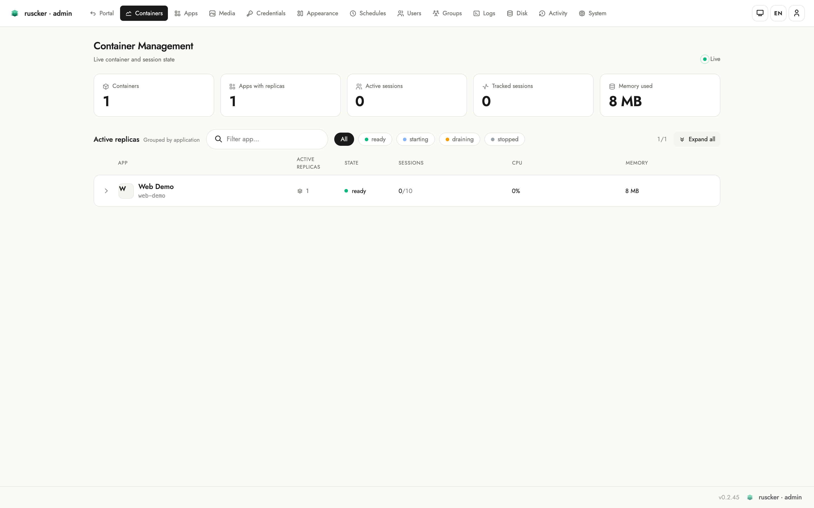
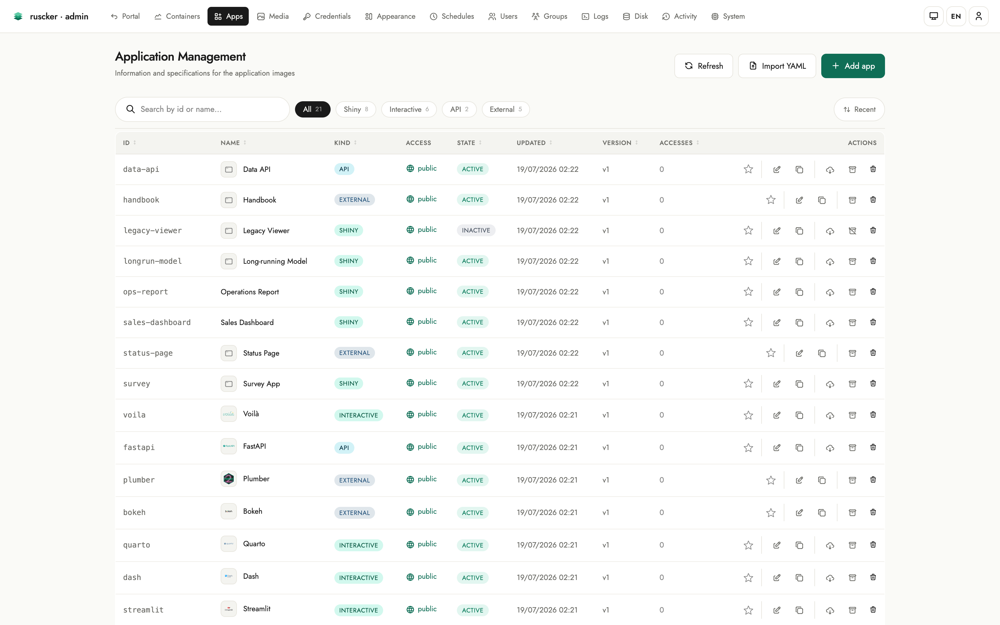
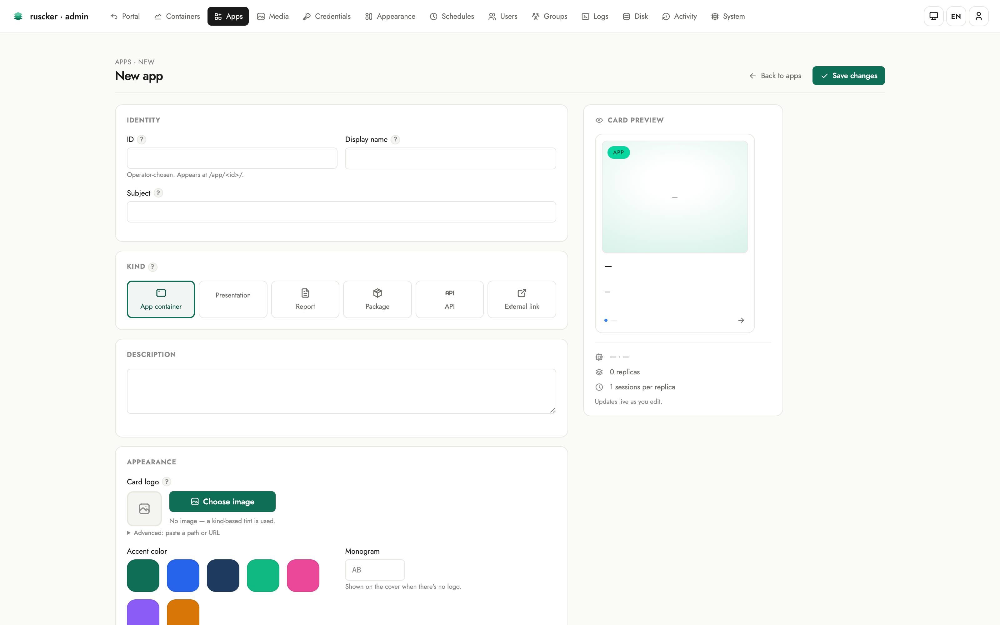
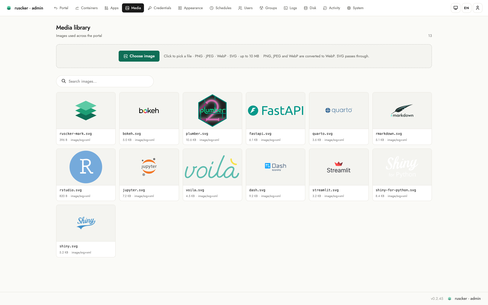
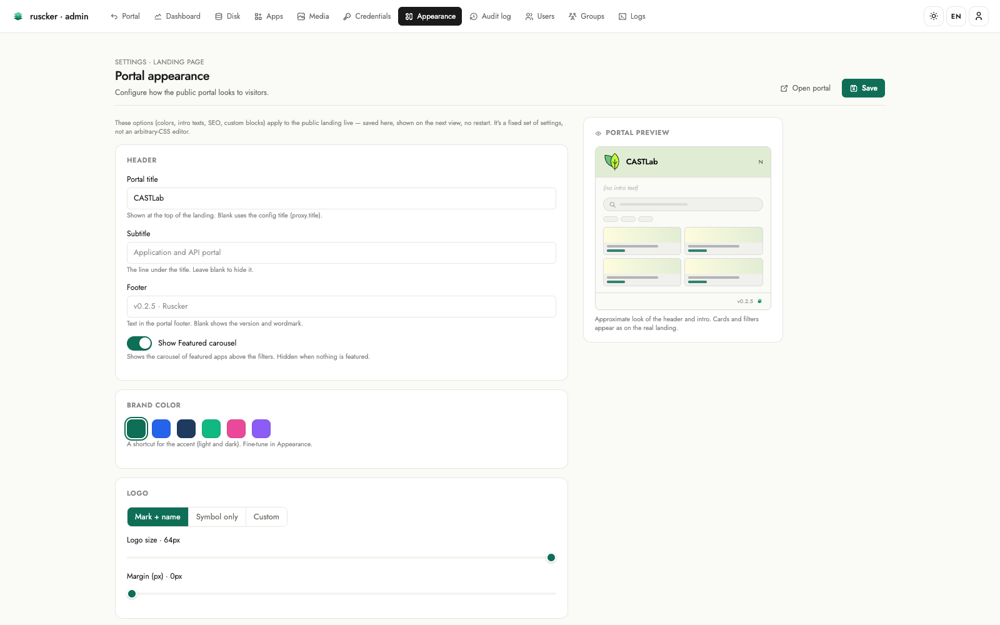
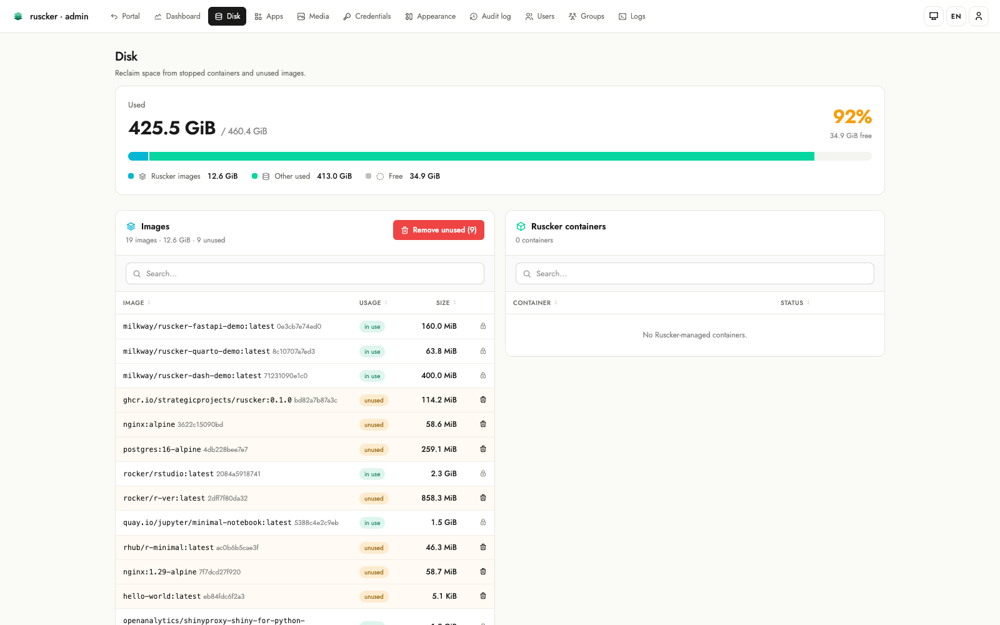
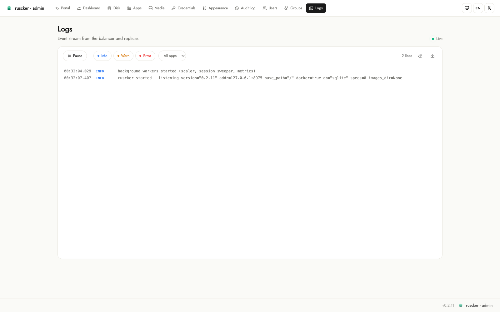

# The admin panel

The admin panel is Ruscker's main advantage over editing YAML by hand.
It lives at `/admin`, is gated by a token, and needs a SQLite database
(`serve --db <file>`).

**Everything is configurable from the web UI** — every spec field
(including API, scaling, resource and lifecycle settings), the media
library, encrypted credentials, and the whole landing page. YAML
import/export exists for migration and backups, not as a requirement.

## Logging in

On first run, set `RUSCKER_ADMIN_TOKEN` (the `.deb` generates one on
install and prints it once) and browse to `/admin/login`: with no
accounts yet you're asked for the **token**, then walked through
creating the first **admin account** (username + password). After that
everyone signs in with their account at `/admin/login`. The token stays
as a **break-glass** login (`/admin/login?token=1`) so you can never be
locked out. Until a token is set, `/admin/*` returns `503` and only the
public landing + proxy are served.

The footer has the same **language** (pt-BR / en-US / es-ES / fr-FR)
and **theme** (light / dark / auto) pickers as the public portal. The
top-right corner shows your current **access level**.

## Users and access levels (roles)

Each person gets their own account (username + password). Admins manage
accounts under **Users** (`/admin/users`): create one, assign a role,
reset a password, or remove it. Each row shows a coloured avatar with the
user's initials and their groups as coloured badges (a group keeps the
same colour on the Groups and Apps pages). A new user gets an initial
password you choose and is asked — once, on first login — whether to
change it. **Password fields are masked** (type `password`) throughout the
panel, so a shoulder-surfer can't read a password as you type it.

| Role | Can do |
|---|---|
| **Viewer** | view the Dashboard only (read-only) |
| **Editor** | view + manage Apps and Media; view the Dashboard and stop/restart replicas |
| **Admin** | everything, including managing users, credentials, the landing editor, custom blocks and the audit log |

The panel shows only the sections your role can reach. Enforcement is
server-side — hiding a nav link is just UX; the routes themselves
return `403` for a role that isn't allowed. The audit log records the
acting username. A **last-admin guard** stops you deleting or demoting
the only remaining admin (so the portal can't be locked out); the
`RUSCKER_ADMIN_TOKEN` break-glass login is the other safety net.

## Screens

### Dashboard
A live view of running replicas, refreshed over Server-Sent Events. The
headline KPI cards (containers, apps with replicas, sessions, memory)
count up on load. Below them, replicas are **grouped by app** in
expandable cards: each card's header summarises the app — replica count,
worst replica state, and aggregate sessions / CPU / memory with little
meters — and expands to the per-replica detail (state, container id,
uptime, sessions, CPU, memory) with stop / restart / logs actions.
A toolbar offers an **expand/collapse-all** control. Shows a banner when
started without `--docker`.

### Apps
The list of specs — apps, APIs and external links — with create, edit
and delete. Each row shows the app's **framework logo** next to its name,
a colour-coded **kind** pill, and an **Access** column with the spec's
access-group badges (or a globe + "public" when ungated). Each row also
has a **featured star** next to the actions: click it to toggle whether
the app appears in the landing page's *Featured* carousel, inline,
without opening the editor (solid = featured).

The add/edit form walks down the page in the order you think about an
app: **Identity** (id, name, subject), **Kind** (app container /
presentation / report / package / API / external link), **Description**,
**Appearance** (card logo via a searchable modal picker over the media
library, an **accent colour** that tints the card, a **monogram**
fallback for logo-less cards, and a solid/gradient **cover builder**),
and **Access & scale** (a Restricted-access toggle with group/user
pickers, an Autoscaling toggle, and an initial-replicas stepper). A
**live card preview** on the right updates as you type, and a **"?"
help popover** on every field explains what it does.

Two editors can have the same app open without trampling each other:
the form carries the version it was loaded against, and a stale save is
rejected with a conflict banner (your input intact) instead of silently
overwriting the other person's changes.

Under the collapsible **Advanced** band, every remaining spec option is
editable too — so an app can be configured end-to-end from the web UI,
without touching YAML:

- **Runtime** — seats per container, session lifetime, inner container
  port and platform.
- **API** (for `type: api`) — container port, rate limit, docs/health
  paths, permissive CORS.
- **Scaling** — min/max replicas and concurrent requests per replica.
- **Resources** — per-container CPU and memory limits.
- **Lifecycle** — the heartbeat (idle-session) timeout.

Every advanced field is optional; leaving it blank keeps Ruscker's
default, so the section stays out of the way until you need it.

### Groups
Groups (`/admin/groups`, admin-only) gate which apps a user sees. They're
**derived**, not a separate table: a group exists as long as a user belongs
to it or an app lists it under `access-groups`. The page shows every group
with its members and the apps it gates, and lets you edit them in place:

- **Rename** a group — the change propagates across every user membership
  and every app that references it.
- **Delete** a group — it's removed everywhere (an app left with no groups
  becomes open to all).
- **Add / remove members** inline, and **create** a group by adding its
  first member under a new name.

Edits touch the database-managed users and apps. An app defined in the
`serve --config` YAML stays read-only here (edit the file for those).

### Media
Upload images (PNG/JPEG → WebP), served at `/assets/img/<file>`. These
are the card logos and covers.

The gallery is a single unified library — **built-in logos** (brand marks
shipped with Ruscker) are seeded here automatically alongside your uploads.
Every image can be **deleted** from the gallery; if it is referenced by any
spec logo/cover or landing logo, the entry shows an **"in use" badge** so
you know before deleting.

When editing a spec you can open a **modal picker** (search, browse, drag
and drop, or upload inline without leaving the form) to select a logo or
cover. A "Choose image" button auto-uploads on file select for a one-click
flow.

### Credentials
A named, AES-256-GCM-encrypted store for registry credentials (needs
`RUSCKER_MASTER_KEY`). Passwords never appear in the YAML or in the
panel after saving. Each entry accepts either a literal password
(encrypted at rest) or a **pure `${VAR}` env-ref** — stored verbatim and
resolved to the real value only at container pull time.

In the spec form the Registry section is a **credential picker**: type or
select the name of a stored credential and Ruscker resolves it at spawn.
There is no need to inline registry passwords in a spec.

### Appearance
Customise the public landing without a custom template. Every control
is mirrored instantly in a **live portal preview** on the right:

- **Header & branding** — header style presets, a solid/gradient
  background builder, brand-colour swatches per theme, a default theme
  (light / dark / auto) for first-time visitors, and the header logo's
  mode, size and margin.
- **Catalog** — grid, list or sections layout; comfortable or compact
  density; a default **card-cover** builder (auto / solid / gradient)
  for cards without their own cover; toggles for the search box and
  filter chips.
- **Colours + intro** — header background/foreground, a per-locale
  intro paragraph, and an editable footer.
- **SEO & sharing** — page title, meta description, `og:image`, with a
  live Google-style **search-result preview** that updates as you type.
  The landing `<head>` emits `description` + `og:*` + `twitter:card`.
- **Analytics & custom code** — pick a provider (GA4 / Plausible /
  Matomo) and paste just the site key — Ruscker builds the snippet and
  widens **only the landing's** CSP for that provider's origins. A raw
  HTML field remains as the escape hatch for anything else. The custom-CSS and analytics/HTML fields are
  **syntax-highlighted code editors** (the custom HTML blocks editor too).
- **Logos** — add logos to the landing **header** or **footer** slot.
  Each logo has its own **alignment** (left / center / right), an optional
  **click-through link**, and a **height** in pixels. Multiple logos
  sharing a slot and alignment render side by side. Images come from the
  Media library — pick one with the same modal picker used in the spec
  form.

### Blocks
Custom HTML blocks rendered in the landing `top` (after the header) and
`bottom` (after the card grid) slots. Create/edit/delete, enable/
disable, and reorder within a slot with the ↑/↓ buttons. Each block can
declare CSP origins for any third-party content it embeds.

> Block and analytics HTML is rendered **verbatim** on the public
> landing. It's admin-only input — the intentional escape hatch — so
> only paste HTML you trust.

### Disk

Storage at a glance (Admin-only). A usage hero shows host disk used /
total with a percentage and a stacked bar split into Ruscker images,
other used, and free. Below it, two panels list the Ruscker-managed
containers and images — each removable, with an "in use" cross-reference
so you don't delete something a running app or the effective catalog
needs, plus bulk "prune stopped containers" and "remove unused images".

### Logs

The server log stream, live over Server-Sent Events. Lines are colour-
coded by level, with level chips (info / warn / error), an app filter
dropdown, a line counter, and pause/resume + clear controls. A download
link grabs the current buffer.

### Audit log
Every admin mutation (spec/image/credential/landing/block changes,
imports) is recorded with actor, action, target and timestamp — and
since v0.2.5 the dashboard's destructive **replica stop/restart**
actions are too.

## Config vs. database

`serve --config` drives the public landing and the proxy. The admin
panel reads and writes the SQLite DB. Use `ruscker import` to populate
the DB from a YAML, and `ruscker export` to round-trip it back — both
preserve specs, landing customization, SEO/analytics and custom
blocks.
