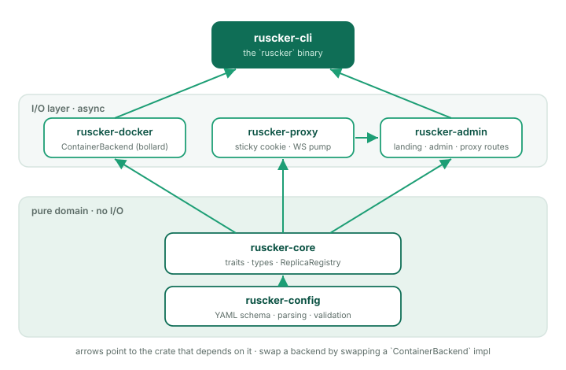

# Architecture

Ruscker is an Apache-2.0-licensed, lightweight Rust alternative to
ShinyProxy and Shiny Server: a portal and orchestrator for
container-per-session and container-per-API workloads. This document
describes how the pieces fit together.

## High-level diagram


All of this is a single Rust process — one static binary, ~14 MB idle,
no JVM. The portal uses Askama templates with HTMX and Alpine.js and has
zero Node build step. Visitors and API clients reach it on one port; it
serves the landing page and admin UI, reverse-proxies `/app/{spec}` and
`/api/{spec}` to the right replica (keeping Shiny sessions sticky and
upgrading WebSockets), and drives the Docker daemon to spawn and reap
containers. SQLite is the source of truth for configuration; the live
replica registry and session store live in memory.

## Crate map

The workspace is six crates. `ruscker-config` and `ruscker-core` are
**pure-domain** — no I/O, no async (bar the async trait *definitions*
in core). Everything that touches the network or Docker layers on top,
and the `ruscker-cli` binary stitches them together.



Keeping the backend behind the `ContainerBackend` trait in
`ruscker-core` is what made the multi-host backend
(`ruscker-docker::MultiHostDockerBackend`, Phase 6) a new impl rather
than a rewrite — and leaves the same door open for Kubernetes. The
multi-host impl covers the **whole** trait surface
(spawn/stop/list, metrics/logs, disk management, image
presence/pull), each operation fanning out across hosts with
degraded-mode tolerance for an unreachable daemon. See
[Deployment shapes](#deployment-shapes) and `docs/adr/`.

## Request flow

### A Shiny session lifecycle

```
1. Visitor hits  https://portal/app/sales-dashboard/
2. Look up spec 'sales-dashboard' (DB first, YAML fallback)
3. Resolve access identity; enforce ACL and mfa::evaluate before any
   backend access or cold start
4. Read cookie  __ruscker_session_sales-dashboard   (one per app)
5. Cookie missing → resolve_replica:
     a. pick_or_spawn: pick a Ready replica with a free seat
        (least-conn) and reserve the seat atomically
     b. No replica yet → cold-start splash to the visitor while a
        coalesced spawn runs in the background; the splash polls a
        readiness probe and reloads into the app
     c. At max-replicas with no free seat → the splash says "full"
        and keeps polling for a freed seat
     d. SessionStore.touch_or_register(session, spec, R2)
     e. Sign + set cookie  __ruscker_session_sales-dashboard
        (Path={base}/app/sales-dashboard — never sent to other apps)
6. Forward GET /  to  http://127.0.0.1:<R2_port>/   (path strip)
7. Stream response back
8. Browser opens WebSocket  ws://portal/app/sales-dashboard/websocket
9. Proxy connects the upstream WS FIRST (query string preserved,
   subprotocol negotiated); only then answers the client's 101 — a
   dead replica gets a clean 502, not a post-upgrade drop
10. Bidirectional frame pump
11. On heartbeat: SessionStore.touch()
12. Idle timeout reached → Session purged → if last seat, container drained
```

### An API request lifecycle

```
1. Client hits  https://portal/api/data-api/v1/data
2. Spec.kind() == Api  → no sticky cookie path
3. pick_replica() balances by in-flight request count → R3
4. Bump R3's in-flight gauge, forward request, stream response
5. In-flight gauge drops only after the full body has streamed out
6. No session state, no follow-up — done.
```

An `Api` spec has no sticky sessions, so its replicas have no seat
notion to balance on. Instead the proxy keeps a per-replica **in-flight
request gauge** (`routes::proxy::INFLIGHT`, a process-global `DashMap`)
and least-connections routing picks the replica with the **fewest
in-flight requests**, not the most free seats. An RAII
`routes::proxy::InflightGuard` bumps the gauge when the forward starts;
crucially it is **moved into the streaming response body**, so it only
drops once the whole (possibly long) download has been sent to the
client — a large file transfer keeps counting against the replica for
its full duration, and the scaler sees real concurrency rather than a
spike that vanishes the instant headers are written.

### Access, MFA, and identity resolution

The proxy resolves a signed-in user's groups and selected profile claims
once per request when an ACL or identity disclosure needs them. The
`IdentityCache` in `AppState` holds groups, e-mail, and department/unit for
30 seconds so an app page's asset burst does not issue one database query
per request. User/group/profile mutations invalidate the cache with a
generation counter, preventing an in-flight stale read from repopulating
revoked identity data.

The request guard then applies these boundaries in order:

1. `Spec::access_allows` enforces per-user/per-group access server-side.
2. For `require-mfa`, `mfa::evaluate` checks the user factor and browser
   grant before the backend, cold-start splash, replica picker, or spawn can
   run. Interactive visits redirect to enrollment/challenge; APIs fail with
   `401` or `403`; break-glass Admin sessions bypass with an audit record.
3. The proxy strips the entire client-supplied `X-SP-*` and
   `X-Ruscker-User-*` namespaces, then adds only the opted-in authoritative
   values for a signed-in user. The same header list is passed to HTTP and
   WebSocket upstream connections; absent claims are omitted.

MFA persistence is part of the configuration catalog in both SQLite and
Postgres:

| Table | Purpose |
|---|---|
| `user_mfa` | One user-owned TOTP factor; AES-GCM ciphertext/nonce, confirmation state, replay step, and revocation epoch |
| `user_mfa_recovery` | Salted hashes for the one-time recovery codes |
| `user_mfa_grants` | Salted hashes of opaque trusted-device tokens, bound to the user, factor epoch, proof time, expiry, and login-session hash |

### Scheduled jobs

`jobs::spawn` starts one scheduler loop per process when both a catalog DB
and container backend exist (the local Docker backend runs jobs; the
multi-host backend does not, so a due schedule there records an error). Every 30 seconds it loads enabled `schedules`;
only the `LeaderElector` winner may fire in HA. `db::schedules::mark_fired`
atomically advances `last_run_at` before execution, so a split-brain second
runner loses the claim and a crash does not double-fire the occurrence.

A new schedule anchors at `created_at` (no fire-on-create). If downtime spans
several cron occurrences, the next tick collapses them to one firing. The job
uses the spec's image, platform, resolved environment, volumes, limits,
network, labels, and registry credentials, with an optional command override,
and runs to completion outside the interactive replica registry. A
per-schedule timeout defaults to one hour in the backend. Results, duration,
exit code, and log tail land in `schedule_runs`; failures enqueue the
`job-failed` alert webhook.

### Aggregated access counter

`access_counter::AccessCounter` keeps the proxy hot path free of database
writes. It synchronously increments an in-memory `(spec_id, UTC day)` delta
for each API request, new sticky app session, or external-card click. One
supervised task flushes touched buckets every two seconds into `spec_access`
with additive UPSERTs. Failed flushes merge deltas back for bounded
exponential-backoff retries, and graceful shutdown attempts a final flush.

### Proxying an app under `/app/{spec}/` — the strip-and-rewrite model

A containerised app expects to live at the host root: it emits
`/lib/jquery.js`, opens `WebSocket('/websocket')`, redirects to `/lab`.
Ruscker serves it from a sub-path (`/app/sales-dashboard/`). Two halves
reconcile that gap.

**On the way in, the proxy *strips* the mount prefix.** `forward()`
matches `/app/{spec}/{*rest}` and forwards only the `*rest` portion to
the container, so a request for `/app/sales-dashboard/lib/x` reaches the
upstream as `/lib/x` — the container believes it is at the root and
never has to know its public path. (This is the opposite of ShinyProxy's
no-strip model; apps should be configured to serve at root, not to
self-prefix.) The proxy also stamps `X-Forwarded-Prefix` /
`X-Script-Name` / `X-RStudio-Root-Path` with the public mount so apps
that *do* build their own absolute URLs (RStudio, Jupyter) emit correct
links — see `routes::proxy::apply_smart_routing_headers`.

**On the way out, the proxy *rewrites* the response so the browser sends
follow-up requests back under the mount.** This lives in
`routes::rewrite` (`inject_base_href`) and runs only on the
`/app/` route family, only for HTML responses:

- **`<base href="/app/{spec}/">`** is injected at the top of `<head>`,
  so relative URLs (`foo.css`, `./img/x.png`) resolve under the mount.
- **Root-absolute attribute URLs** (`<script src="/lib/x">`,
  `<link href="/...">`, `<form action="/...">`, …) are prefixed with the
  mount via a streaming `lol_html` pass over a narrow selector set. A
  skip-list (`/admin/`, `/assets/`, `/app/`, …) avoids double-prefixing
  Ruscker's own chrome; notably `/api/` is **not** skipped, because under
  the mount it is the *app's* own namespace (Jupyter's REST + kernel
  WebSocket live there).
- **A runtime JS shim** is prepended before any page script. It
  monkey-patches `fetch`, `XMLHttpRequest.open`, and `WebSocket` to
  prefix absolute paths built at runtime. The shim was **generalized**
  to also patch the resource-loading property setters
  `HTMLScriptElement.prototype.src`,
  `HTMLLinkElement.prototype.href`, and `HTMLImageElement.prototype.src`
  (plus `iframe`/`audio`/`video`/`source` and `Element.setAttribute`).
  Those are the browser's *own* fetches — never visible to the fetch/XHR
  wrappers — so patching them covers RequireJS/webpack chunk loading and
  runtime-set images generically.
- **A redirect `Location` header** that points at a root-absolute path
  (an app's `302 → /lab`) is prefixed the same way, so the redirect stays
  inside the app instead of escaping to a Ruscker 404.

The generalized shim **retired the old Voilà-specific rewrite**: Voilà's
RequireJS bootstrap assigns its static URLs to `script.src` at runtime,
which the patched `src` setter now prefixes without a bespoke pass.

**The rewriter needs uncompressed HTML**: nothing between
the container and the rewriter decompresses bodies, so when the
transform is enabled the upstream request carries
`Accept-Encoding: identity` (ShinyProxy does the same) — an app that
gzips its HTML (Dash behind flask-compress, nginx-fronted) would
otherwise stream compressed bytes straight past `inject_base_href`.
Defense-in-depth: a response that still arrives with a
`Content-Encoding` passes through untouched rather than being
corrupted. The `/api/` family and `inject-base-href: false` specs are
never transformed and keep end-to-end compression.

**JupyterLab is the one app that still needs a special case**
(`rewrite::rewrite_jupyter_config`). Lab is served with `base_url=/` and
reports `baseUrl: "/"` in its `jupyter-config-data` JSON; its bootstrap
then builds **absolute, same-origin** API and static URLs from that
config and injects `<script src=…>` for its lazy chunks. Because those
URLs are absolute strings baked into a config object — not relative paths
the browser resolves against `<base href>`, and not paths a root-relative
shim can intercept — Ruscker rewrites the `baseUrl` and `full*Url` fields
of that JSON to carry the mount before the HTML pass.

The base-path mount (Ruscker itself served under, e.g., `/apps`) is the
inverse rewrite and is handled separately: templates emit `{{ base }}`-
prefixed URLs directly, so the chrome no longer needs a per-request body
rewrite — only the redirect `Location` header (`prefix_base_path`).

## Module boundaries

### Pure layer (no I/O, no async)

- `ruscker-config::schema`
- `ruscker-config::env`
- `ruscker-config::validate`
- `ruscker-core::replica` (types only — incl. the seat accounting on
  `ReplicaRegistry`; the replica-*picking* logic lives next to the
  proxy in `ruscker-admin::routes::proxy::{pick_replica,
  pick_accepting}`, where the seat reservation has to be atomic)
- the trait *definitions* in `ruscker-core` (`ContainerBackend`, …)
  are pure; the async `SessionStore` trait + its in-memory/Postgres
  impls live in `ruscker-admin::sessions`

### I/O layer (async + tokio)

- `ruscker-docker` — talks to Docker
- `ruscker-proxy` — sticky-cookie + WebSocket helpers (a library; it
  owns no socket)
- `ruscker-admin` — builds the single axum router (landing + admin +
  proxy routes). Proxy selection, access/MFA/identity guards, and response
  filtering live in `routes::proxy`; persistent MFA operations live in
  `db::mfa` / `db::mfa_grants`; background subsystems live in `jobs`,
  `scaler`, and `access_counter`
- `ruscker-cli` — owns the one TCP listener and the tokio runtime,
  serving `ruscker-admin`'s router

## State and persistence

### Three sources of state, ranked by authority

1. **SQLite (admin DB)** — source of truth for spec configurations,
   images, credentials, users/groups, MFA factors and grants, schedules and
   run history, per-day access totals, landing-page sections, and audit log.
   Always write here first. Postgres implements the same catalog for HA.
2. **Live in-memory** — `ReplicaRegistry` (in proxy), `SessionStore`
   (in proxy, in-memory by default). Reflects the *running* state of
   containers and sessions.
3. **Docker** — actual containers and their state. Source of truth for
   "is this thing alive". The proxy queries Docker on startup to
   rebuild the registry.

The YAML file is **NOT** the mutable source of truth in production — it is
the service bootstrap plus import/export format. `ruscker.yml` is the
canonical service-config filename; `application.yml` remains the compatible
ShinyProxy import/fallback name. Once imported, live catalog edits reside in
SQLite or the HA Postgres catalog.

### State transitions

- **First boot, no DB**: Bootstrap from the selected service config
  (`ruscker.yml` by default, with `application.yml` as fallback) if present;
  otherwise create an empty DB.
- **Subsequent boots**: Load from DB. The YAML is optional.

## Concurrency model

- One tokio runtime, multi-threaded by default.
- The proxy accepts connections on one task per connection, handlers
  use `tower` middleware stack.
- Container spawns are direct `ContainerBackend` calls, serialized
  per spec by a coalescing mutex (`state.spawn_locks`) so concurrent
  visitors to a cold app produce one container, not N.
- The auto-scaler runs as a periodic task (every 10s). Apps default to
  `min-replicas: 0` (cold-start — spawn on the first visit, no pre-warm);
  it scales up on sustained saturation, retires idle replicas after a
  grace window, then waits out a post-drop cooldown (~60s) before it will
  respawn on saturation, so a single-seat long session can't flap a
  replica up and down. Set `min-replicas: 1`+ to keep an app warm.
- The session-purger runs as a periodic task (every 5s).
- The leader-only job scheduler checks cron schedules every 30s and detaches
  each run-to-completion job so long ETL work cannot block later ticks.
- The access-counter drain batches in-memory deltas every 2s instead of
  writing on every proxy request.
- `DashMap` backs the replica/in-flight state and the short-TTL identity/spec
  caches (lock-free reads, sharded writes).

## Security boundary

### Trust levels

- **Untrusted**: visitors. They can hit `/app/*` and `/api/*` only.
  Admin paths require an authenticated session.
- **Privileged**: signed-in users. Authentication uses per-user passwords
  and three roles — **Viewer** (portal access only; no admin section),
  **Editor** (dashboard, apps, and media), **Admin** (everything, incl. user
  management) — enforced server-side. A break-glass `RUSCKER_ADMIN_TOKEN`
  bootstraps the first account. See `docs/SECURITY.md` §2.
- **Operator**: filesystem access (the person running Ruscker). Can
  edit YAML, restart the process.

### Secrets at rest

- Docker registry passwords: stored encrypted in
  `credentials.password_enc` via AES-GCM with a master key from
  `RUSCKER_MASTER_KEY` env var.
- User TOTP secrets: stored as AES-GCM ciphertext and nonce in `user_mfa`
  under the same master key; recovery and trusted-device tokens are stored
  only as salted hashes.
- Session cookie signing: HMAC-SHA256 with key from
  `RUSCKER_COOKIE_KEY` env var (randomized per process when unset —
  set it explicitly to keep sessions across restarts and across HA
  instances).
- TLS: terminated by the reverse proxy in front (Ruscker never
  terminates TLS itself — see `docs/SECURITY.md` §7/§9).

## Deployment shapes


### Single-node (default)

A reverse proxy terminates TLS in front of a single Ruscker, which
talks to the local Docker daemon over its socket. This is what 99% of
installs run — simple, fast, easy to operate.

### Multi-node HA (active-active, since Phase 7)

Two or more Ruscker instances behind an L4 load balancer share a Postgres
config catalog and session store, so either can serve any session.
Exactly one instance holds leadership at a time via a Postgres advisory
lock; standbys serve traffic and reconcile counts but skip the scaler and
scheduled-job firing loops. The sticky cookie is an HMAC over a shared key,
so any instance can validate any other's cookie. See the deployment guide's
"Running active-active" section for the runnable example.

### Multi-host Docker (since Phase 6)

Orthogonal to HA: one Ruscker instance can drive **several Docker
daemons** (`proxy.hosts` — ssh / tcp+TLS / unix), placing replicas by
weighted spread or bin-pack with optional anti-affinity. The proxy
reaches each container directly at `host:published-port`, so keep the
hosts on a private network. Combine with HA freely — the placement map
is per-instance, rebuilt from container labels on `list()`.

## What's not covered here

- The admin UI internals — see the `ruscker-admin` crate
  (`cargo doc --open`).
- The proxy's WebSocket handling — see the `ruscker-proxy` crate.
- Specific algorithm choices — see `docs/adr/`.
- The YAML schema — see `docs/YAML_SCHEMA.md`.
